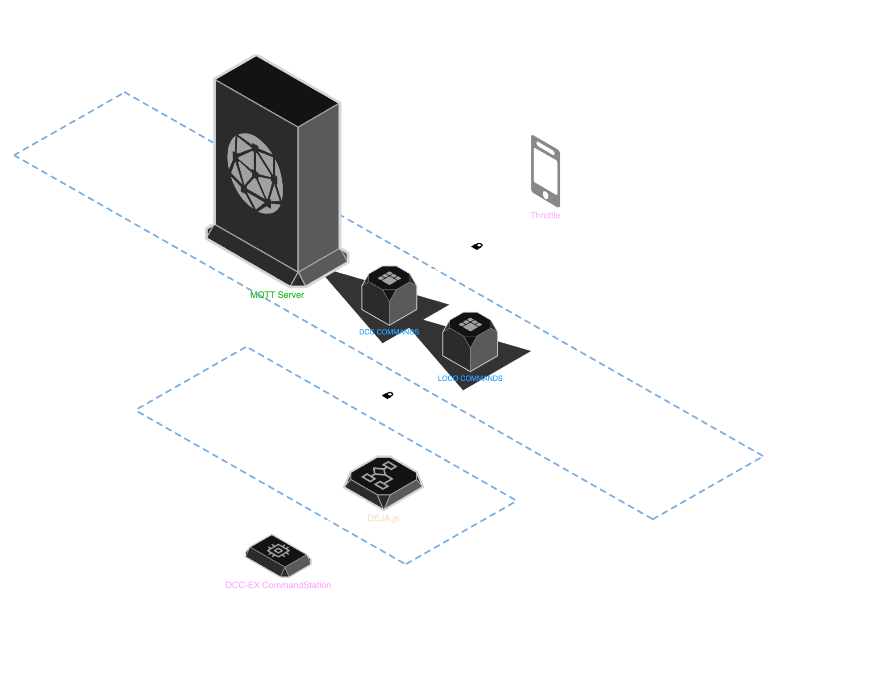
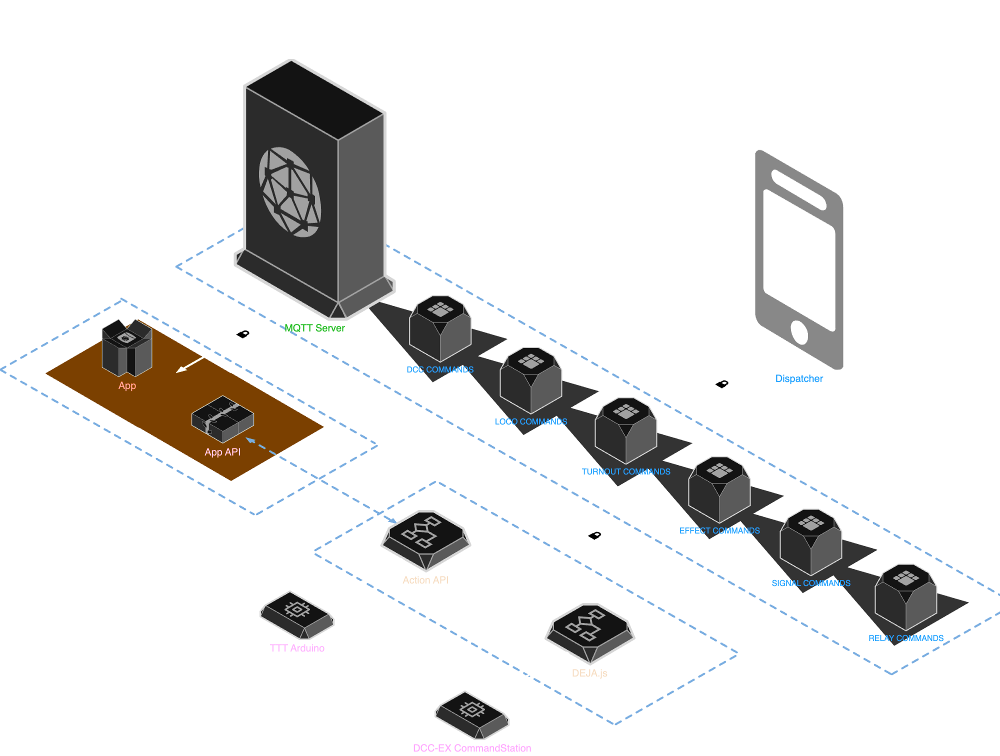
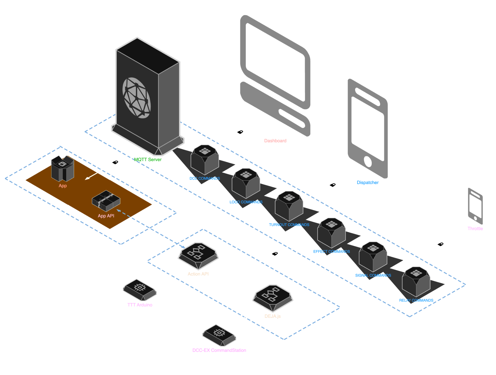
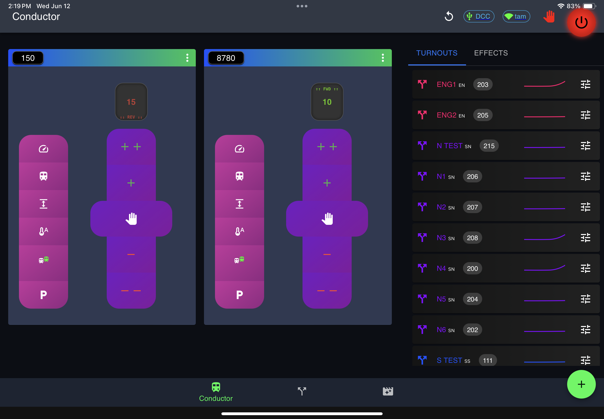
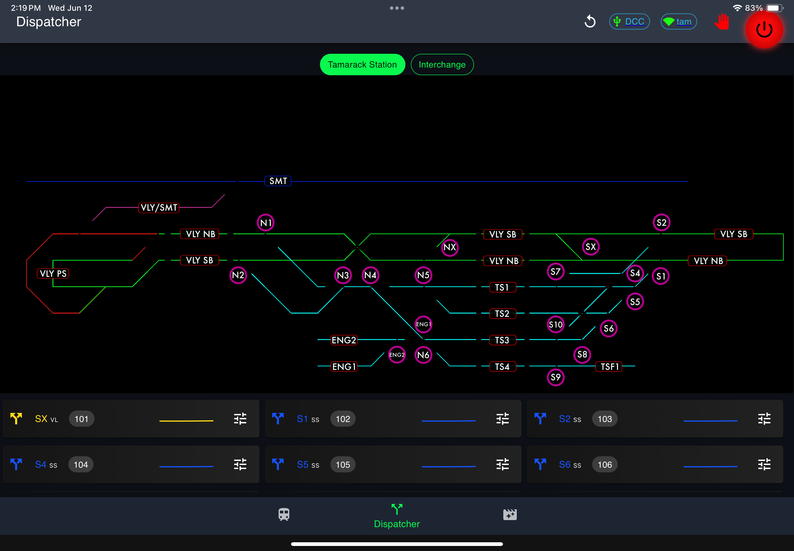
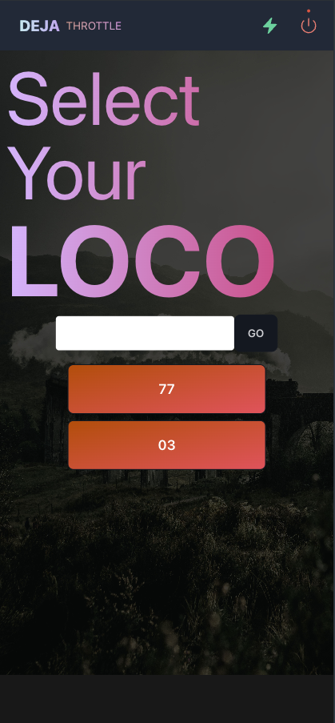
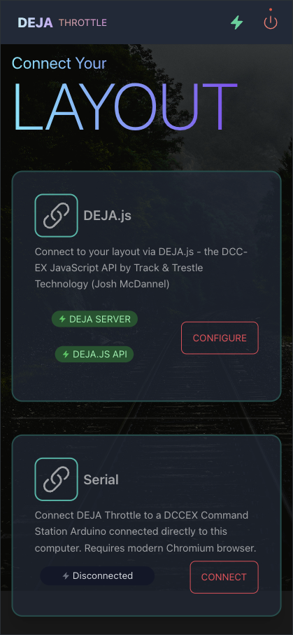
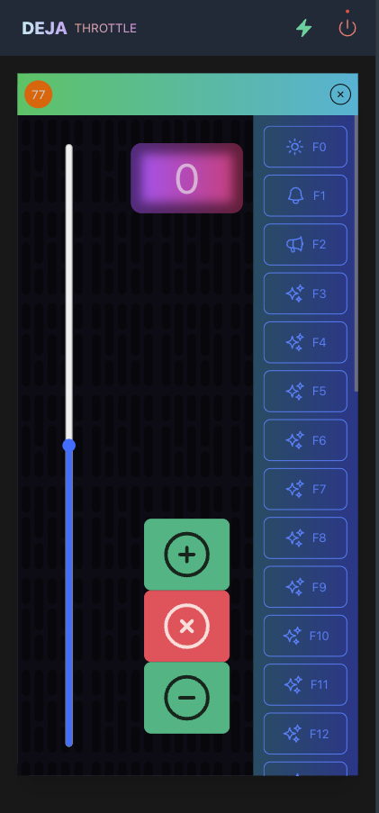

<p align="center">
  
</p>
<h1 align="center">Track and Trestle Technology</h1>

This suite of applications is designed and developed to support a model railroad using a [DCC-EX EX-CommandStation](https://dcc-ex.com/ex-commandstation/index.html) and additional Arduinos, Raspberry Pis or other devices that support the required protocols. The applications communicate using [MQTT 📡](https://mqtt.org/). The apps (Throttle App, Dispatcher App, Dashboard App) publish commands like throttle speed and direction, turnouts, or effects like lights, sounds and signals. The servers ([DEJA.js](https://github.com/jmcdannel/DEJA.js)) for DCC commands, Action API for Arduinos and other supported interfaces) subscibe to those commands, process them, and then send them to the appropriate interface. [DEJA.js](https://github.com/jmcdannel/DEJA.js) sends [DCC-EX Native Commands](https://dcc-ex.com/reference/software/command-summary-consolidated.html) via Serial over USB to the DCC-EX CommandStation, while the ActionAPI sends serial commands to usb-connected Arduinos.

## ✨ Features

- 💄 Beautiful DCC locomotive throttles designed for ease of use
- 💻 Connect to PC/Mac/Linux/Pi via USB
- 🎛️ Control turnouts - servos or momentary relays (Kato switches!)
- 💡 Toggle lights, 🪩 IALEDs and 🚦 Signals
- 🎼 Play sounds
- 🛤️ Toggle routes
- ✨ Toggle relays, control motor drivers, juice frogs, control LCDs
- 👑 Rule over your tiny world

## 🧩 Usage

### Prerequisites for all configurations

1. 📦 [Install & Configure DCC-EX EX-CommandStation](https://dcc-ex.com/ex-commandstation/index.html) via USB to Mac/PC/Linux/Raspberry Pi
2. 📦 Install NodeJS 21+ on Mac/PC/Linux/Raspberry Pi
  - Install NVM, Node 21 [Recommended] 
    > `curl -o- https://raw.githubusercontent.com/nvm-sh/nvm/v0.39.1/install.sh | bash`
    ```
    $ nvm install 21
    ```

2. 📦 Install Lerna
  ```
  $ pnpm install -g lerna
  ```

3. 📝 Configure Environments
> See package README files for configuration instructions.

### Run all packages Locally
```
$ lerna run start
```

---

### Bare Minumum [[DEJA.js](https://github.com/jmcdannel/DEJA.js)] + [Throttle]

1. 📦 Install DEJA.js
2. 🚀 Launch [Throttle App](https://trestle-tt-suite-ttt-throttle-app.vercel.app/)

<p align="center">
  
</p>

---

### [[DEJA.js](https://github.com/jmcdannel/DEJA.js)] + [ActionAPI] + [App] + [Dispatcher]

1. 📦 Install DEJA.js
2. 📦 Install ActionApi
3. 📝 Configure App
4. 🚀 Launch [Dispatcher App](https://ttt-dispatcher-app.vercel.app/)

<p align="center">
  
</p>

### [[DEJA.js](https://github.com/jmcdannel/DEJA.js)] + [ActionAPI] + [App] + [Dispatcher] + [Throttle] + [Dashboard]

1. 📦 Install DEJA.js
2. 📦 Install ActionApi
3. 📝 Configure App (currently a manual step)
4. 🚀 Launch Dashboard
5. 🚀 Launch [Throttle App](https://trestle-tt-suite-ttt-throttle-app.vercel.app/)
6. 🚀 Launch [Dispatcher App](https://ttt-dispatcher-app.vercel.app/)

<p align="center">
  
</p>

### DCC-EC

// 🛰️ [DEJA.js](https://github.com/jmcdannel/DEJA.js) Server
 
## 📦 Packages

### 🧠 [Action Api](packages/ttt-action-api/README.md)

The Action API listens to commands sent from the Throttle App, Dispatcher App or Dashboard and sends or executes those commands on the target interface. Supported interfaces include:
- Arduino via USB
- Raspberry Pi Pico W (via MQTT)
- Audio output

- Required [App]

[📜 Read More](packages/ttt-action-api/README.md)

---
### 🚆 [Dispatcher App](packages/ttt-dispatcher-app/README.md)

React App that handles all layout operations including throttles, turnouts and effects.

<p align="center">
  
</p>

<p align="center">
  
</p>

[📜 Read More](packages/ttt-dispatcher-app/README.md)

---
### 🎚️ [Throttle App](packages/ttt-throttle-app/README.md)

VueJS app for simple throttle operations.

<p align="center">
  
  
  
</p>

[📜 Read More](packages/ttt-throttle-app/README.md)

---
### 🔱 [TTT App](packages/ttt-app/README.md)

NextJS app hosted on Vercel. The main purpose of this package is to provide secure REST API access to MongoDB. 🚧 Future enhancements will include landing pages, documentation, demos, and the Dashboard App.

[📜 Read More](packages/ttt-app/README.md)

---
### 🎛️ [Dashboard App](packages/ttt-dashboard-app/README.md)

Preact app that displays layout information about the DCC-EX EX-CommandStation.

- 🪵 DCC Command Log
- 💥 DCC-EX EX-CommandStation Status and Stats
- 📈 Current Usage in Miliamps
- 🚄 Active Locomotive Speeds

[📜 Read More](packages/ttt-dashboard-app/README.md)

---
### 🧬 IO

This package contains source code for the devices found in Tamarack Junction - the author's model railroad. These scripts are specific for each device and the connections to those devices. 🚧 Future improvements to these scripts will allow each device to run a single source package and configured using `config.h` files.

## Resources

# 🚂🚆🚇🚊🚉🛰️🚀🚦🚧⛰️🛤️📱💻📡🎛️⚙️⚠️🔱🟢🟣🔵🟠🟡🔴❤️‍🔥🎼🧩✨☄️🍀☘️🌲🕶️🧠🔗🖲f🏓🪢🧶🎨👑🔈🔀🔁

### Layouts

// TODO: Describe
### Locos

// TODO: Describe
### Turnouts

// TODO: Describe
### Effects

// TODO: Describe
### Routes

// TODO: Describe
### Sensors


## 🛠️ Built With

* [![React][React.js]][React-url]
* [![Node][Node.js]][Node-url]
* [![Next][Next.js]][Next-url]
* [![Vue][Vue.js]][Vue-url]
* [![Preact][Preact]][Preact-url]
* [![MQTT][MQTT.js]][MQTT-url]
* [![Lerna][Lerna.js]][Lerna-url]
* [![MongoDB][MongoDB]][MongoDB-url]
* [![TypeScript][TypeScript]][TypeScript-url]
* [![Sass][Sass]][Sass-url]
* [![Tailwind][Tailwind.css]][Tailwind-url]
* [![MUI][MUI]][MUI-url]
* [![DaisyUI][DaisyUI]][DaisyUI-url]
* [![Arduino][Arduino]][Arduino-url]
* [![Raspberry Pi][RaspberryPi]][RaspberryPi-url]
* [![MicroPython][MicroPython]][MicroPython-url]
* [![Chart.js][ChartJS]][ChartJS-url]
* [![Immer][Immer]][Immer-url]
* [![Vite][Vite]][Vite-url]
* [![pnpm][pnpm]][pnpm-url]
* [![ESLint][ESLint]][ESLint-url]
* [![Prettier][Prettier]][Prettier-url]
* [![Autoprefixer][Autoprefixer]][Autoprefixer-url]
* [![.ENV][ENV]][ENV-url]
* [![Webpack][Webpack]][Webpack-url]


<!-- MARKDOWN LINKS & IMAGES -->
<!-- https://www.markdownguide.org/basic-syntax/#reference-style-links -->
[contributors-shield]: https://img.shields.io/github/contributors/github_username/repo_name.svg?style=for-the-badge
[contributors-url]: https://github.com/github_username/repo_name/graphs/contributors
[forks-shield]: https://img.shields.io/github/forks/github_username/repo_name.svg?style=for-the-badge
[forks-url]: https://github.com/github_username/repo_name/network/members
[stars-shield]: https://img.shields.io/github/stars/github_username/repo_name.svg?style=for-the-badge
[stars-url]: https://github.com/github_username/repo_name/stargazers
[issues-shield]: https://img.shields.io/github/issues/github_username/repo_name.svg?style=for-the-badge
[issues-url]: https://github.com/github_username/repo_name/issues
[license-shield]: https://img.shields.io/github/license/github_username/repo_name.svg?style=for-the-badge
[license-url]: https://github.com/github_username/repo_name/blob/master/LICENSE.txt
[linkedin-shield]: https://img.shields.io/badge/-LinkedIn-black.svg?style=for-the-badge&logo=linkedin&colorB=555
[linkedin-url]: https://linkedin.com/in/linkedin_username
[product-screenshot]: images/screenshot.png
[Node.js]: https://img.shields.io/badge/node.js-5FA04E?style=for-the-badge&logo=nodedotjs&logoColor=white
[Node-url]: https://nodejs.org/
[Next.js]: https://img.shields.io/badge/next.js-000000?style=for-the-badge&logo=nextdotjs&logoColor=white
[Next-url]: https://nextjs.org/
[React.js]: https://img.shields.io/badge/React-20232A?style=for-the-badge&logo=react&logoColor=61DAFB
[React-url]: https://reactjs.org/
[Vue.js]: https://img.shields.io/badge/Vue.js-35495E?style=for-the-badge&logo=vuedotjs&logoColor=4FC08D
[Vue-url]: https://vuejs.org/
[Angular.io]: https://img.shields.io/badge/Angular-DD0031?style=for-the-badge&logo=angular&logoColor=white
[Angular-url]: https://angular.io/
[Svelte.dev]: https://img.shields.io/badge/Svelte-4A4A55?style=for-the-badge&logo=svelte&logoColor=FF3E00
[Svelte-url]: https://svelte.dev/
[Laravel.com]: https://img.shields.io/badge/Laravel-FF2D20?style=for-the-badge&logo=laravel&logoColor=white
[Laravel-url]: https://laravel.com
[Bootstrap.com]: https://img.shields.io/badge/Bootstrap-563D7C?style=for-the-badge&logo=bootstrap&logoColor=white
[Bootstrap-url]: https://getbootstrap.com
[JQuery.com]: https://img.shields.io/badge/jQuery-0769AD?style=for-the-badge&logo=jquery&logoColor=white
[JQuery-url]: https://jquery.com 


[Tailwind.css]: https://img.shields.io/badge/Tailwind-06B6D4?style=for-the-badge&logo=tailwindcss&logoColor=white
[Tailwind-url]: https://tailwindcss.com/
[MQTT.js]: https://img.shields.io/badge/MQTT-660066?style=for-the-badge&logo=mqtt&logoColor=white
[MQTT-url]: https://mqtt.org/
[Lerna.js]: https://img.shields.io/badge/Lerna-9333EA?style=for-the-badge&logo=lerna&logoColor=white
[Lerna-url]: https://lerna.js.org/
[MongoDB]: https://img.shields.io/badge/Mongo_DB-47A248?style=for-the-badge&logo=mongodb&logoColor=white
[MongoDB-url]: https://www.mongodb.com/
[pnpm]: https://img.shields.io/badge/pnpm-F69220?style=for-the-badge&logo=pnpm&logoColor=white
[pnpm-url]: https://pnpm.io/
[TypeScript]: https://img.shields.io/badge/Typescript-3178C6?style=for-the-badge&logo=typescript&logoColor=white
[TypeScript-url]: https://www.typescriptlang.org/
[ENV]: https://img.shields.io/badge/.ENV-ECD53F?style=for-the-badge&logo=mui&logoColor=white
[ENV-url]: https://www.example.com
[MUI]: https://img.shields.io/badge/Material_UI-007FFF?style=for-the-badge&logo=mui&logoColor=white
[MUI-url]: https://mui.com/material-ui/
[DaisyUI]: https://img.shields.io/badge/daisyUI-5A0EF8?style=for-the-badge&logo=daisyui&logoColor=white
[DaisyUI-url]: https://daisyui.com/
[Arduino]: https://img.shields.io/badge/Arduino-00878F?style=for-the-badge&logo=arduino&logoColor=white
[Arduino-url]: https://www.arduino.cc/
[RaspberryPi]: https://img.shields.io/badge/Raspberry_Pi-A22846?style=for-the-badge&logo=raspberrypi&logoColor=white
[RaspberryPi-url]: https://www.raspberrypi.com/
[MicroPython]: https://img.shields.io/badge/Circuit_Python-2B2728?style=for-the-badge&logo=micropython&logoColor=white
[MicroPython-url]: https://circuitpython.org/
[ESLint]: https://img.shields.io/badge/ESLint-4B32C3?style=for-the-badge&logo=eslint&logoColor=white
[ESLint-url]: https://eslint.org/
[Prettier]: https://img.shields.io/badge/Prettier-F7B93E?style=for-the-badge&logo=prettier&logoColor=white
[Prettier-url]: https://prettier.io/
[Vite]: https://img.shields.io/badge/Vite-646CFF?style=for-the-badge&logo=vite&logoColor=white
[Vite-url]: https://vitejs.dev/
[Autoprefixer]: https://img.shields.io/badge/Autoprefixer-DD3735?style=for-the-badge&logo=autoprefixer&logoColor=white
[Autoprefixer-url]: https://autoprefixer.github.io/
[Preact]: https://img.shields.io/badge/Preact-673AB8?style=for-the-badge&logo=preact&logoColor=white
[Preact-url]: https://preactjs.com/
[ChartJS]: https://img.shields.io/badge/Chart.JS-FF6384?style=for-the-badge&logo=chartdotjs&logoColor=white
[ChartJS-url]: https://www.chartjs.org/
[Immer]: https://img.shields.io/badge/Immer-00E7C3?style=for-the-badge&logo=immer&logoColor=white
[Immer-url]: https://immerjs.github.io/immer/
[Sass]: https://img.shields.io/badge/Sass-CC6699?style=for-the-badge&logo=sass&logoColor=white
[Sass-url]: https://sass-lang.com/
[Webpack]: https://img.shields.io/badge/Webpack-8DD6F9?style=for-the-badge&logo=webpack&logoColor=white
[Webpack-url]: https://webpack.js.org/
