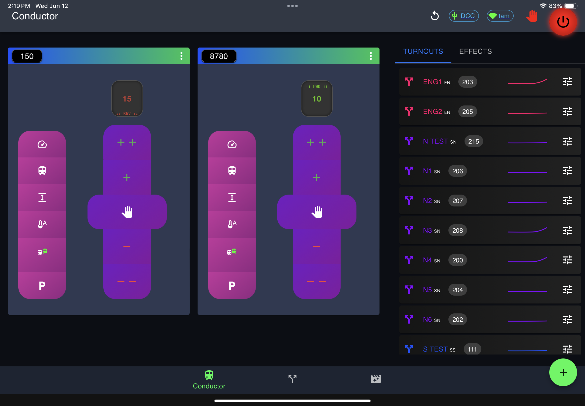

# Dispatcher App

React App that handles all layout operations including throttles, turnouts and effects.

[Demo](https://ttt-dispatcher-app.vercel.app/)

<p align="center">
  
</p>

<p align="center">
  
</p>


## 🚀 Getting Started

### 📦 Prerequisites
See [Global Prerequisites](../../README.md)

### 📦 Installation

```sh
pnpm install
pnpm run start
```

## 🧩 Usage

### Connections

// TODO

### Conductor

// TODO

### Dispatcher

// TODO

### Orchestrator

// TODO

### Settings / DCC

// TODO

## 🛠️ Built With

// TODO